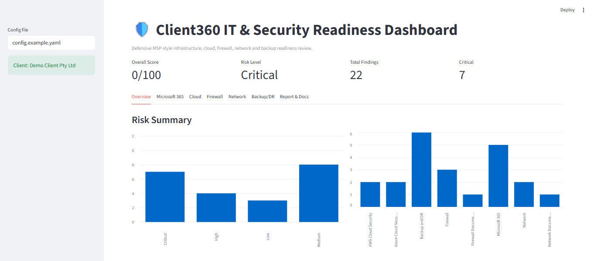
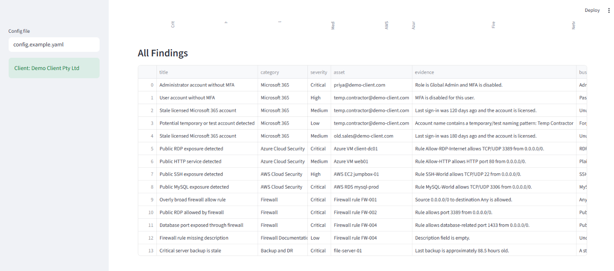
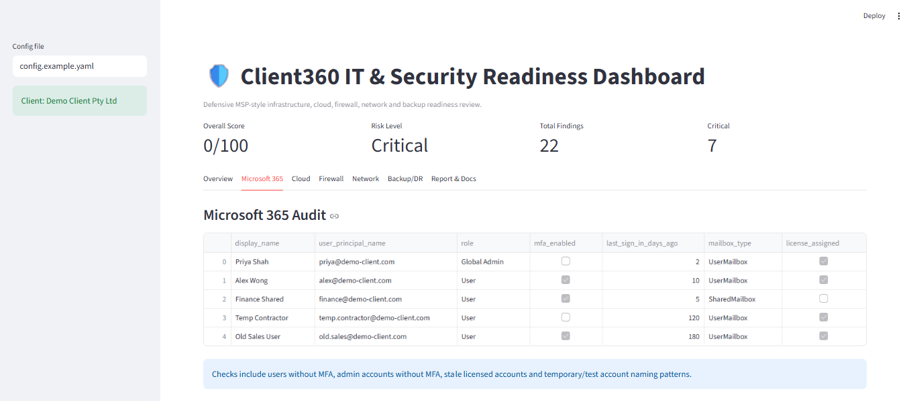
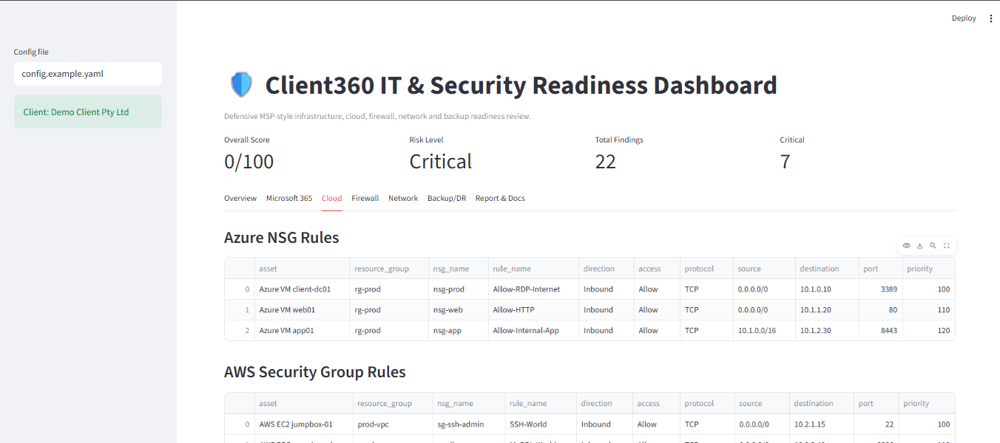
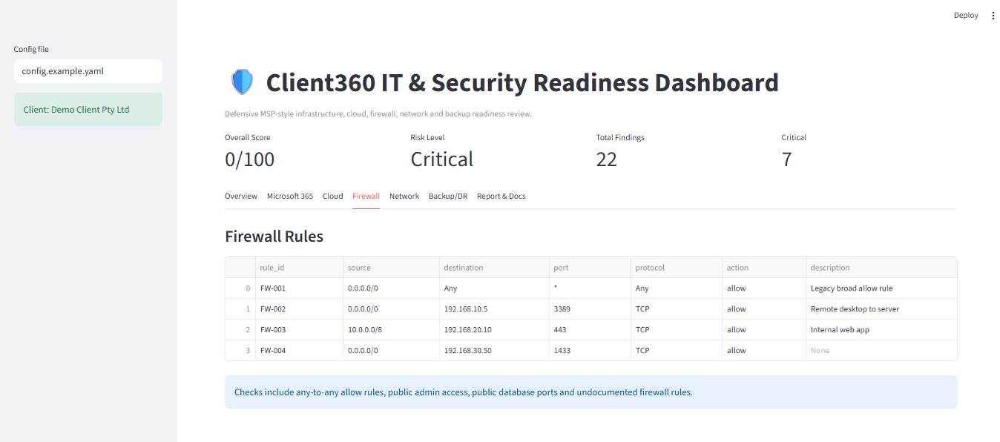
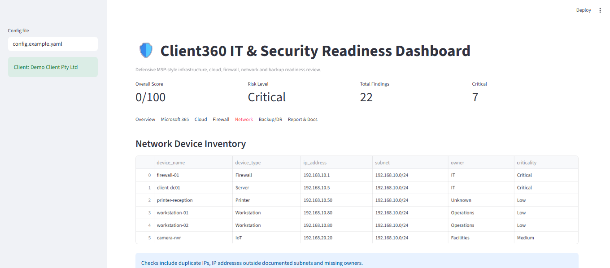
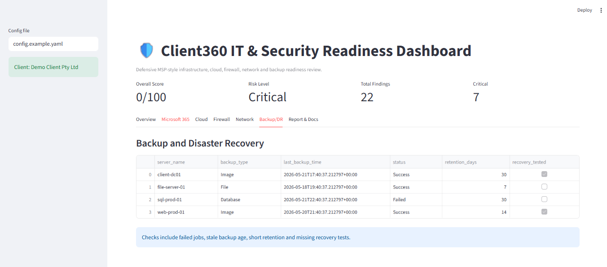
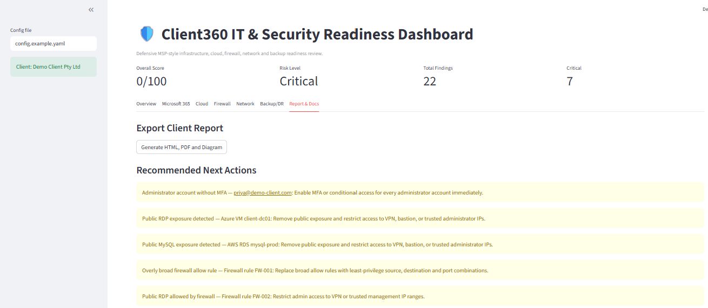

# Client360: IT Infrastructure & Cyber Security Readiness Dashboard

Client360 is a defensive IT infrastructure and cyber security readiness dashboard designed for MSP-style client support environments. It helps a junior IT solutions / cyber security engineer document client environments, review Microsoft 365, Azure, AWS, firewall, network and backup configuration data, identify common risks, and generate a client-ready report.

This project was designed to align with internship-style responsibilities such as Microsoft 365 support, cloud inventory, networking, subnetting, firewall rule review, backup/disaster recovery checks, documentation, and client communication.

> **Authorisation note:** This tool is only for systems, tenants, cloud accounts, networks, and data you own or are explicitly authorised to assess.

---

## Key Features

- Microsoft 365 user and MFA posture audit using CSV/sample export
- Azure NSG rule review using JSON/CSV export-ready structure
- AWS Security Group review using CSV/sample export
- Network device inventory and subnet validation
- Firewall rule risk analysis
- Backup and disaster recovery health checker
- Risk scoring engine with Low / Medium / High / Critical severities
- Client-ready HTML report export
- Optional PDF report export
- Mermaid architecture diagram generation
- Streamlit dashboard for non-technical visual review
- Pytest unit tests for core logic

---

## Tech Stack

- Python
- Streamlit
- Pandas
- SQLite-ready structure
- Jinja2
- ReportLab
- PyYAML
- Optional: Microsoft Graph, Azure CLI, AWS boto3

---

## Project Structure

```text
client360-it-security-readiness-dashboard/
├── app/
│   └── dashboard.py
├── client360/
│   ├── analyzers/
│   ├── collectors/
│   ├── reports/
│   └── utils/
├── data/sample/
├── docs/
├── reports/
├── scripts/
└── tests/
```

---

## Setup

### Windows PowerShell

```powershell
python -m venv venv
.\venv\Scripts\Activate.ps1
pip install -r requirements.txt
python scripts\run_audit.py
streamlit run app\dashboard.py
```

### macOS / Linux

```bash
python3 -m venv venv
source venv/bin/activate
pip install -r requirements.txt
python scripts/run_audit.py
streamlit run app/dashboard.py
```

---

## Demo Workflow

1. Run `python scripts/run_audit.py`
2. Open `reports/client360_report.html`
3. Run `streamlit run app/dashboard.py`
4. View risks by category and severity
5. Export client report from the dashboard

---

## Sample Data

The project runs fully using demo files inside:

```text
data/sample/
```

No cloud account is required for the demo.

---

## Optional Real API / Cloud Integration

The collectors folder contains API-ready starter modules:

```text
client360/collectors/microsoft365_graph_collector.py
client360/collectors/azure_cli_collector.py
client360/collectors/aws_boto3_collector.py
```

Use `.env.example` and `config.example.yaml` as templates. Do not commit real secrets.

---

## Screenshots

### Dashboard Overview

The dashboard gives a quick summary of the client environment, including the overall risk score, risk level, total findings, critical issues, and visual risk breakdowns.



---

### Risk Findings

All detected issues are collected into a single findings table with severity, asset, evidence, business impact, and recommended remediation.



---

### Microsoft 365 Audit

The Microsoft 365 module checks sample user posture, including MFA status, admin users, stale accounts, mailbox type, and licensing status.



---

### Cloud Exposure Review

The cloud module reviews Azure NSG rules and AWS Security Group rules to identify risky public exposures such as public RDP, SSH, HTTP, and database access.



---

### Firewall Rule Review

The firewall module checks for broad allow rules, public administrative access, exposed database ports, and missing rule descriptions.



---

### Network Documentation

The network module provides a client device inventory and supports documentation of assets such as firewalls, servers, workstations, printers, and IoT devices.



---

### Backup and Disaster Recovery

The backup/DR module checks backup success, failure status, retention days, stale backups, and whether recovery testing has been performed.



---

### Client Report and Recommended Actions

The report section generates a client-ready summary with recommended next actions based on the highest-risk findings.



---

## Disclaimer

Client360 is not a penetration testing tool. It is a defensive readiness, documentation, and configuration review tool for authorised environments.
