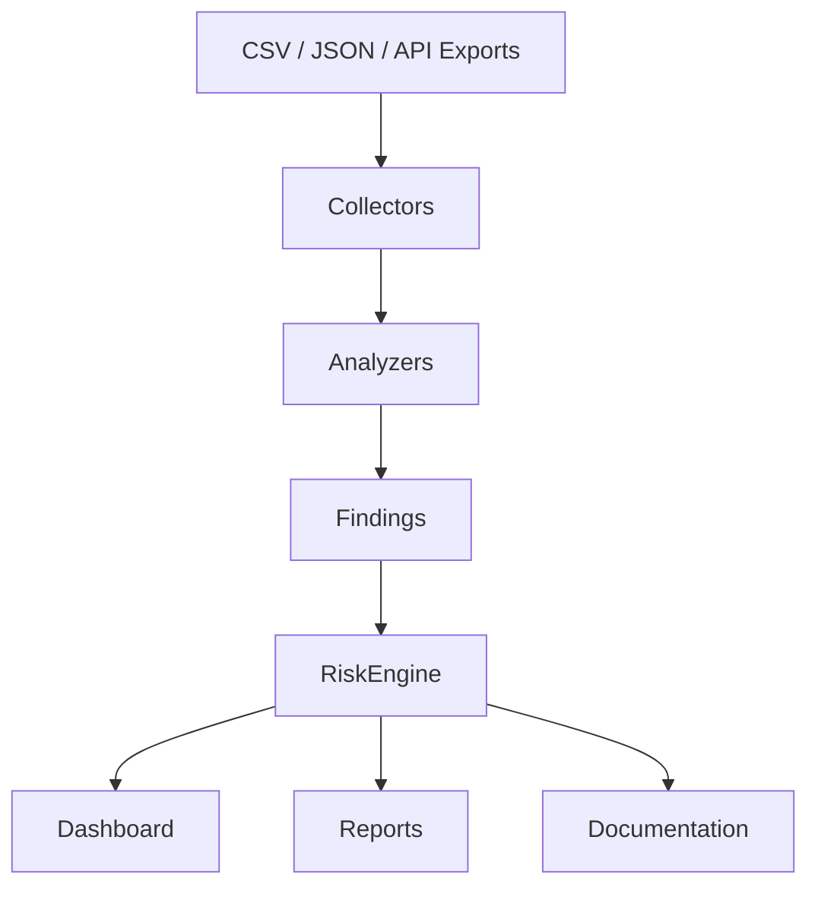

# Client360 Architecture

Client360 follows a simple modular architecture:

1. **Collectors** load Microsoft 365, Azure, AWS, firewall, backup and network data.
2. **Analyzers** inspect each dataset and produce structured findings.
3. **Risk engine** calculates severity counts and an overall readiness score.
4. **Reports** generate client-ready HTML/PDF output and a Mermaid diagram.
5. **Streamlit dashboard** presents the same findings visually for support engineers.

## Why this design is useful for an MSP role

- It supports authorised client environment documentation.
- It avoids destructive or offensive testing.
- It makes findings readable for technical and non-technical stakeholders.
- It can be extended with real Microsoft Graph, Azure CLI and AWS boto3 collectors.
