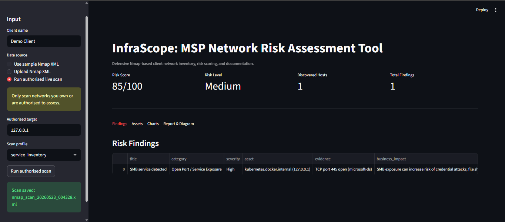
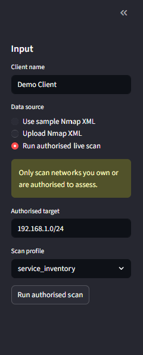
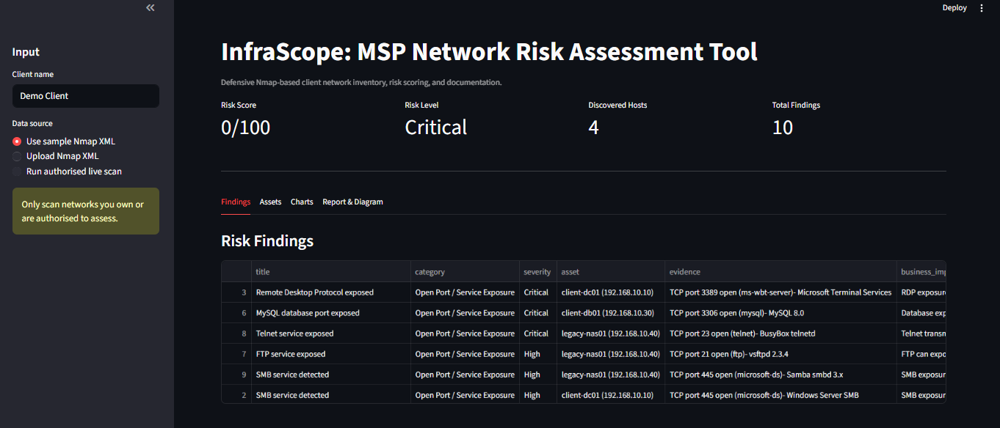
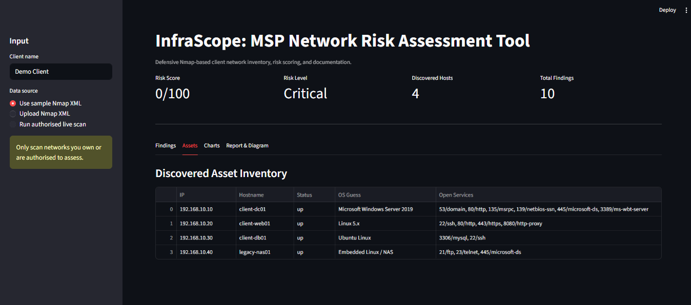
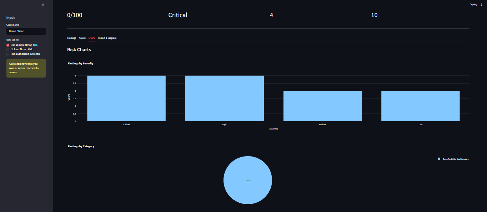
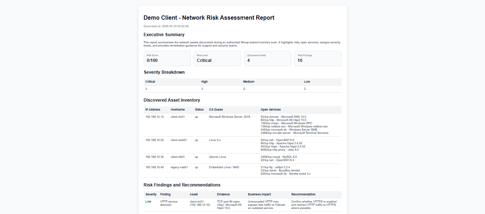
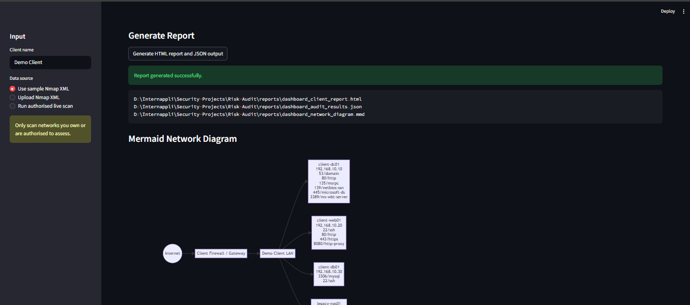
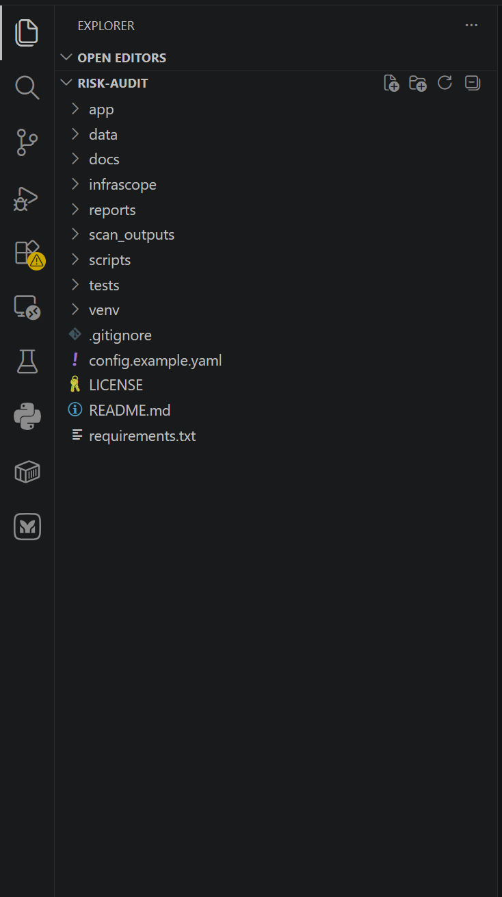

# InfraScope: MSP Network Risk Assessment & Client Documentation Tool

InfraScope is a defensive network risk assessment and client documentation tool designed for MSP-style IT support and junior cyber security roles.

It converts Nmap scan results into a clean asset inventory, highlights risky services, calculates a risk score, generates a client-ready HTML report, and creates a simple Mermaid network diagram.

This project was built to demonstrate practical experience in:

- Python-based security risk assessment automation
- Nmap XML parsing and service inventory
- Network/subnet documentation
- Firewall/open-port exposure review
- Client-ready reporting and remediation guidance
- MSP-style infrastructure support workflows

> **Ethical use only:** Run scans only on networks and systems you own or are authorised to assess.

---

## Features

- Import and parse Nmap XML scan results
- Optional authorised live Nmap scan from the dashboard or CLI
- Detect risky services such as RDP, SMB, FTP, Telnet, exposed databases, and insecure web services
- Assign Low, Medium, High, or Critical severity
- Calculate an overall client risk score
- Build a discovered asset inventory
- Generate a professional HTML report
- Generate a Mermaid network diagram
- Streamlit dashboard for visual review
- Unit tests for parser and risk engine
- Sample Nmap scan included, so the project runs without external accounts

---

## Project Structure

```text
Risk-Audit/
├── app/
│   └── dashboard.py
├── infrascope/
│   ├── analyzers/
│   │   └── risk_engine.py
│   ├── collectors/
│   │   └── nmap_runner.py
│   ├── parsers/
│   │   └── nmap_xml_parser.py
│   ├── reports/
│   │   ├── diagram_generator.py
│   │   ├── report_generator.py
│   │   └── templates/client_report.html
│   └── utils/
│       └── file_utils.py
├── data/sample/sample_nmap_scan.xml
├── reports/
├── scripts/
│   ├── run_audit.py
│   └── run_scan.py
├── tests/
├── config.example.yaml
├── requirements.txt
└── README.md
```

---

## Quick Start

### 1. Clone and enter project

```bash
git clone https://github.com/yourusername/msp-risk-audit-tool.git
cd Risk-Audit
```

### 2. Create virtual environment

Windows PowerShell:

```powershell
python -m venv venv
.\venv\Scripts\Activate.ps1
```

Mac/Linux:

```bash
python3 -m venv venv
source venv/bin/activate
```

### 3. Install dependencies

```bash
pip install -r requirements.txt
```

### 4. Run sample audit

```bash
python scripts/run_audit.py
```

Expected output:

```text
Audit completed successfully.
HTML report: reports/sample_client_report.html
JSON results: reports/audit_results.json
Mermaid diagram: reports/network_diagram.mmd
```

### 5. Run dashboard

```bash
streamlit run app/dashboard.py
```

---

## Optional: Live Authorised Nmap Scan

The project runs with the included sample XML file by default.

To run real scans, install Nmap first:

- Windows: install Nmap from the official installer and ensure `nmap` is available in PATH
- macOS: `brew install nmap`
- Linux: `sudo apt install nmap`

Then run:

```bash
python scripts/run_scan.py --target 192.168.1.0/24 --client "Demo Client"
```

The default live scan uses a safe inventory-focused profile:

```text
-sn host discovery for discovery mode
-sV --top-ports 1000 for service inventory mode
```

Only scan systems where you have permission.

---

## Output Verification

Run:

```bash
python scripts/run_audit.py
pytest -q
```

Check these outputs:

```text
reports/sample_client_report.html
reports/audit_results.json
reports/network_diagram.mmd
```

Open the HTML report in a browser. You should see:

- Executive summary
- Risk score
- Asset inventory
- Risk findings
- Remediation recommendations
- Network diagram text

---
## Possible future connectors:

- Microsoft Graph API for Microsoft 365 security posture
- Azure CLI export for NSG/security rules
- AWS boto3 for security groups
- Datto/backup platform export CSV

---
## Screenshots

### Dashboard Overview


### Scan Input and Data Source Options


### Risk Findings Table


### Discovered Assets and Open Services


### Risk Summary Charts


### Generated Client HTML Report


### Generated Network Diagram


### Project Code Structure


