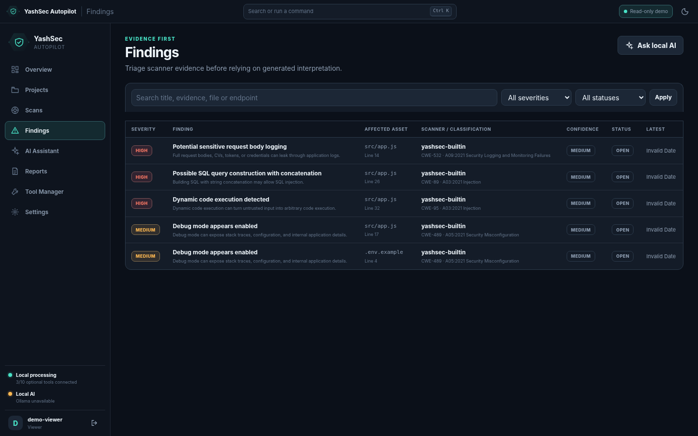

# YashSec Autopilot

<p align="center">
  
</p>

<p align="center"><strong>Local-first repository and API security orchestration with evidence-led triage, optional local AI, and a safe public portfolio mode.</strong></p>

<p align="center">
  
  
  
  
  
</p>

> **Authorised defensive use only.** Scan repositories, APIs, and environments that you own or have explicit permission to assess.


## Why this repository is different

YashSec Autopilot does not treat a tool exit code as proof of security. It records what ran, what failed, what was skipped, what evidence was produced, and what still requires human review.

The repository supports two deliberately separate operating modes:

| Mode | Purpose | AI | Scanning capability |
|---|---|---|---|
| **Local workspace** | Real authorised security reviews on Windows or Docker | Local Ollama by default; AirLLM optional | Built-in checks plus installed Semgrep, Gitleaks, Trivy, Schemathesis, ZAP baseline, and safe dynamic checks |
| **Public portfolio demo** | A safe live showcase from GitHub | Ollama Cloud through a host-side secret, optional | Read-only seeded sample only; arbitrary cloning, uploads, process execution, and dynamic targets are disabled |

The public demo is intentionally not a free internet-facing penetration-testing service. That boundary prevents anonymous visitors from abusing compute, cloning arbitrary repositories, or directing scanners at third-party systems.

## Included in this release

- FastAPI backend with SQLite persistence, local authentication, RBAC, sessions, lockout controls, and tamper-evident audit chaining.
- Repository registration from local folders, Git URLs, or safely extracted ZIP archives.
- Stack, startup command, port, and OpenAPI detection with explicit execution approval.
- Normalised findings with severity, confidence, CWE/OWASP metadata, evidence, remediation, review status, and report export.
- Built-in fallback scanner plus adapters for Semgrep, Gitleaks, Trivy, Schemathesis, and OWASP ZAP baseline.
- Local Ollama integration and opt-in Ollama Cloud support without exposing the API key to the browser.
- Public read-only demo seeding with an intentionally vulnerable bundled target.
- Professional screenshots, GitHub Pages landing site, Docker files, Windows scripts, CI, CodeQL, Dependabot, and deployment documentation.
- Sanitised source package with virtual environments, runtime databases, logs, cloned repositories, local binaries, caches, and `.env` removed.
## Live Demo

Explore the restricted read-only demo of YashSec Autopilot:

[](https://czech-knight.github.io/Security-Projects/)

> The hosted version uses sample data and disables repository cloning, real scanner execution, dynamic testing, scheduling, and configuration changes. Full functionality is available in the local installation.
## Quick start on Windows 11

### Requirements

- Python 3.11 or newer
- PowerShell
- Git for Windows, recommended
- Ollama, optional but recommended for private local AI
- Other scanners only when their coverage is required

### Install

```powershell
Set-ExecutionPolicy -Scope Process Bypass
.\setup.ps1
```

The script creates `.venv`, installs core dependencies, copies safe defaults to `.env`, initialises SQLite, and leaves account creation to the first-run wizard. No password or API token is committed to the repository.

### Run

```powershell
.\start.ps1
```

Open `http://127.0.0.1:8787`, create the first Owner account, then add `sample_targets\vulnerable_demo` and run the built-in scanner.

### Connect local Ollama

```powershell
ollama pull qwen3:8b
ollama list
```

Keep these defaults in `.env`:

```dotenv
YASHSEC_ALLOW_CLOUD_AI=false
YASHSEC_OLLAMA_URL=http://127.0.0.1:11434
YASHSEC_OLLAMA_MODEL=qwen3:8b
```

See [Ollama modes and privacy boundaries](docs/OLLAMA_MODES.md) for smaller models, Docker, cloud opt-in, and troubleshooting.

## Docker: application plus local Ollama

```bash
docker compose up --build
```

The Compose profile starts YashSec, an official Ollama container, and a one-shot model pull for `qwen2.5-coder:1.5b` by default. Open `http://127.0.0.1:8787` after the model download finishes.

```bash
YASHSEC_OLLAMA_MODEL=qwen3:8b docker compose up --build
```

The Docker image intentionally remains lean and does not bundle every third-party scanner. Use the native Windows setup for the broadest local tool integration, or build a separately reviewed internal scanner image.

## Screenshots

| Login and safe demo entry | Findings triage |
|---|---|
|  |  |

| Repository workspace | AI assistant |
|---|---|
|  |  |

More images are listed in [docs/SCREENSHOTS.md](docs/SCREENSHOTS.md).

## Scanner behaviour

A useful scan can complete even when optional tools are unavailable. The built-in scanner always runs. Runtime-only stages require an API URL or an explicitly approved local startup command. Missing or failed stages remain visible as partial coverage rather than being silently treated as success.

| Capability | Core install | Additional requirement |
|---|---:|---|
| Built-in source checks | Yes | None |
| Semgrep SAST | Optional | `semgrep` |
| Secret detection | Optional | `gitleaks` |
| Dependency/config scanning | Optional | `trivy` |
| OpenAPI property testing | Optional | `schemathesis` |
| Passive ZAP baseline | Optional | Docker Desktop |
| Safe dynamic checks | Included | Approved local/staging target |
| Local AI assistant | Optional | Ollama and a pulled model |

Run `doctor.ps1` or open **Tool Manager** to see exact availability and installation guidance.

## Security boundaries

- Local source mode binds to `127.0.0.1`.
- Container binding to `0.0.0.0` requires explicit container mode.
- Remote dynamic targets are rejected unless deliberately enabled.
- Repository startup commands require an authorised user and exact-command confirmation.
- Git credentials are delegated to Git Credential Manager or SSH; YashSec does not store GitHub tokens.
- Authentication-profile secret material is kept outside normal database records.
- Gitleaks evidence is redacted before storage.
- Remote Ollama requires HTTPS, an explicit allow-list, cloud opt-in, and a server-side API key.
- Demo session and AI requests have per-IP rate limits; old public-demo sessions are bounded, and the key never reaches JavaScript.

Read [SECURITY.md](SECURITY.md) and the [sanitisation report](docs/SECURITY_AND_SANITIZATION.md) before publishing a fork.

## Repository layout

```text
app/                  FastAPI application, scanners, orchestration, and SPA
sample_targets/       Intentionally vulnerable local demonstration target
tests/                Security and regression tests
docs/                 Architecture, deployment, operations, and screenshots
site/                  Static GitHub Pages portfolio site
deploy/                Hosting environment templates
scripts/               Build and repository-hygiene utilities
desktop/               Tauri desktop shell source
installer/             Windows installer definition
tools/bin/             Empty location for untracked local scanner binaries
data/                  Empty runtime folders; contents ignored by Git
```

## Verification

```powershell
.\.venv\Scripts\python.exe -m compileall -q app airllm_worker
.\.venv\Scripts\python.exe -m pytest -q
.\.venv\Scripts\python.exe scripts\repository_hygiene.py
```

The prepared package was validated with the test suite, Python compilation, frontend JavaScript syntax checking, demo-mode startup, seeded demo API checks, and a repository hygiene scan. Re-run the commands after every material change.

## Known limitations

- The public deployment is a read-only portfolio demo, not the full local scanner workspace.
- Free hosting and cloud-AI quotas are controlled by their providers and can change; they are not guaranteed unlimited resources.
- The bundled Docker profile does not install heavyweight scanner binaries.
- AI output is interpretation, not scanner-confirmed evidence, and must remain reviewable.
- A local Windows administrator can ultimately alter local application files; the audit chain is tamper-evident, not externally immutable.

## Documentation

- [Live deployment](docs/DEPLOYMENT.md)
- [Ollama modes](docs/OLLAMA_MODES.md)
- [Security and sanitisation](docs/SECURITY_AND_SANITIZATION.md)
- [Architecture](docs/ARCHITECTURE.md)
- [External tools](docs/EXTERNAL_TOOLS_INSTALLATION_AND_INTEGRATION_GUIDE.md)
- [Windows build and release](docs/WINDOWS_BUILD_AND_RELEASE_GUIDE.md)
- [Final validation record](docs/FINAL_VALIDATION_2026-08-04.md)
- [Contributing](CONTRIBUTING.md)

## License

MIT © 2026 Yash. See [LICENSE](LICENSE).
